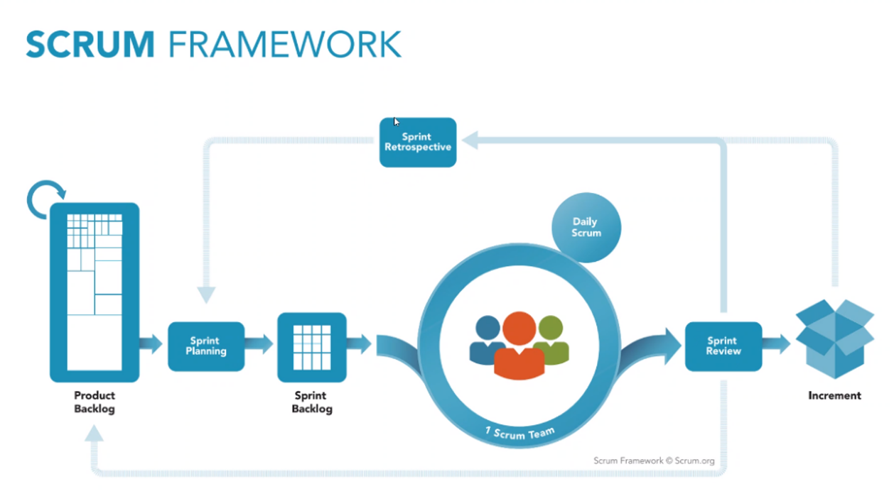

# tech201_agile_and_scrum

## Tech 201 Agile & Scrum

Agile is a philosophy about how software should be developed, it is not any particular tool or method , but a mindset that is inspired by its manifesto.

The Agile manifestio includes the following:
- Individuals and interactions over processes and tools
- Working software over comprehensive documentation
- Customer collaboration over contract negotiation
- Responding to change over following a plan

These are based on 12 principles:
1. Satisfy customers through early and continuous delivery
2. Welcome changing requirements
3. Deliver working software frequently
4. Business people and developers must work together
5. Build projects around motivated individuals
6. The best form of communication is face-to-face
7. Working software is the primary measure of progress
8. Processes that promote sustainable development
9. Continuous excellence enhances agility
10. Simplicity
11. Self-organizing teams generate the most value
12. Regularly reflect and adjust your way of work to boost effectiveness

Whilst continuous delivery is a high priority in Agile it doesn't really give much insight into how its ideas should be implemented. This is where Scrum differs, Scrum is a methodology concerned with the implementation of Agile, following iterative and incremental proccesses.

The benefits of Scrum include:
- Better product quality
- Faster return on investment
- Money and time savings
- Flexibility
- Minimum risks
- Better control and transparency

The above diagram gives us a visual representation of the Scrum Framework. 

The Scrum framework includes elements we call 'Artifacts', the traditional Scrum artifacts include
- Product Backlog
- Sprint Backlog
- Increment

Scrum Artifacts are elements of the Scrum Framework that support and help the Scrum team with their software development journey.
